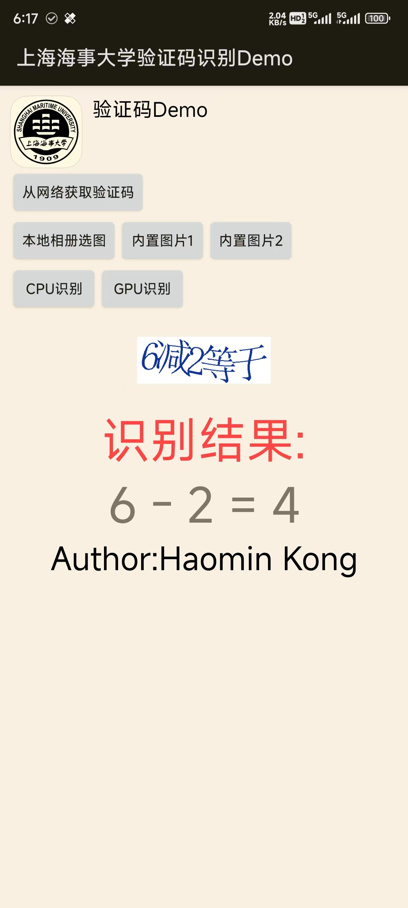

# 上海海事大学 统一认证平台 验证码 OCR Demo(Android)

本项目为上海海事大学统一认证平台验证码OCR识别的Android Demo。

本项目不再维护！

## 截图

## 模型权重

请前往
[a645162/shmtu-cas-ocr-model](https://github.com/a645162/shmtu-cas-ocr-model/releases/tag/v1.0-NCNN)
下载模型权重。

下载至shmtu_ocr/src/main/assets目录。

请选择模型类型:

- FP16精度
	请选择*.fp16.bin与*.fp16.param文件
- FP32精度
	请选择*.fp32.bin与*.fp32.param文件

## 使用到的开源库

* Tencent NCNN
* OpenCV

### NCNN

利用NCNN进行验证码识别的代码请详见VC++中的实现(CAS_OCR.cpp)。

具体路径为: VS解决方案目录\VC\NCNN_Digit\CAS_OCR.cpp

### OpenCV

为了缩小应用的体积，使用了轻量化编译的[opencv-mobile](https://github.com/nihui/opencv-mobile)库。

### 技术栈

- C++
- Kotlin
- Java
- CMake
- OpenCV
- NCNN

## 本系列项目

### 客户端

* Go Wails版
  [https://github.com/a645162/SHMTU-Terminal-Wails](https://github.com/a645162/SHMTU-Terminal-Wails)
* Rust Tauri版(画个饼，或许以后会做吧~)

### 服务器部署模型

验证码OCR识别系列项目今后将只会维护推理服务器(shmtu-cas-ocr-server)这一个项目。

[https://github.com/a645162/shmtu-cas-ocr-server](https://github.com/a645162/shmtu-cas-ocr-server)

注：这个项目为王老师的研究生课程《机器视觉》的课程设计项目，仅用作学习用途！！！

### 统一认证登录流程(数字平台+微信平台)

* Kotlin版(方便移植Android)
  [https://github.com/a645162/shmtu-cas-kotlin](https://github.com/a645162/shmtu-cas-kotlin)
* Go版(为Wails桌面客户端做准备)
  [https://github.com/a645162/shmtu-cas-go](https://github.com/a645162/shmtu-cas-go)
* Rust版(未来想做Tauri桌面客户端可能会移植)
  ps.功能其实和Golang版本没啥区别，甚至可能实现地更费劲，Golang的移植已经让我比较抓狂了，虽然Rust我也是会的，但是或许不会做。。。

注：这个项目为王老师的研究生课程《机器视觉》的课程设计项目，仅用作学习用途！！！

### 模型训练

**神经网络图像分类模型训练**

使用PyTorch以及经典网络ResNet

[https://github.com/a645162/shmtu-cas-ocr-model](https://github.com/a645162/shmtu-cas-ocr-model)

**人工标注的数据集(2选1下载)**

* Hugging Face
  https://huggingface.co/datasets/a645162/shmtu_cas_validate_code
* Gitee AI(国内较快)
  https://ai.gitee.com/datasets/a645162/shmtu_cas_validate_code

训练代码中包含爬虫代码，以及自动测试识别结果代码。
您可以对其修改，对测试通过的图片进行标注，这样可以获得准确的标注。

注：这个项目为王老师的研究生课程《机器视觉》的课程设计项目，仅用作学习用途！！！

### 模型本地部署

* Windows客户端(包括VC Win32 GUI以及C# WPF)
  [https://github.com/a645162/shmtu-cas-ocr-demo-windows](https://github.com/a645162/shmtu-cas-ocr-demo-windows)
* Qt客户端(支持Windows/macOS/Linux)
  [https://github.com/a645162/shmtu-cas-ocr-demo-qt](https://github.com/a645162/shmtu-cas-ocr-demo-qt)
* Android客户端
  [https://github.com/a645162/shmtu-cas-demo-android](https://github.com/a645162/shmtu-cas-demo-android)

注：这3个项目为王老师的研究生课程《机器视觉》的课程设计项目，仅用作学习用途！！！

### 原型测试

Python+Selenium4自动化测试数字海大平台登录流程

[https://github.com/a645162/Digital-SHMTU-Tools](https://github.com/a645162/Digital-SHMTU-Tools)

注：本项目为付老师的研究生课程《Python程序设计与开发》的课程设计项目，仅用作学习用途！！！

## 免责声明

本(系列)项目仅供学习交流使用，不得用于商业用途，如有侵权请联系作者删除。

本(系列)项目为个人开发，与上海海事大学无关，仅供学习参考，请勿用于非法用途。

本(系列)项目为孔昊旻同学的**课程设计**项目，仅用作学习用途！！！
